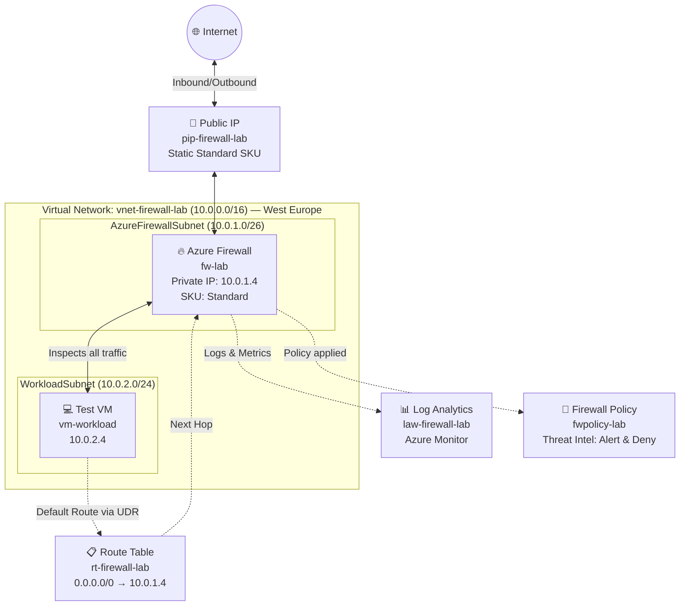

# Architecture Diagram – Azure Firewall Lab

## Network Topology



---

## Subnet Design

| Subnet | CIDR | Purpose |
|--------|------|---------|
| `AzureFirewallSubnet` | `10.0.1.0/26` | **Required** dedicated subnet for Azure Firewall — cannot be renamed |
| `WorkloadSubnet` | `10.0.2.0/24` | Hosts workload VMs — all traffic forced through firewall |

> **Why /26 for AzureFirewallSubnet?**  
> Azure Firewall requires a minimum of /26 for the firewall subnet to accommodate scaling of its infrastructure nodes.

---

## Traffic Flow

### Outbound Traffic (VM → Internet)
```
vm-workload (10.0.2.4)
    │
    ▼ [UDR: Default Route 0.0.0.0/0]
Azure Firewall (10.0.1.4)
    │
    ├── [Application Rules] → Check FQDN against allowlist
    ├── [Network Rules]     → Check IP/Port/Protocol
    ├── [Threat Intel]      → Check against Microsoft threat feeds
    │
    ▼ (if allowed)
pip-firewall-lab (Public IP)
    │
    ▼
Internet
```

### Inbound Traffic (Internet → VM via DNAT)
```
Internet → pip-firewall-lab:8080
    │
    ▼ [NAT Rule: DNAT]
Azure Firewall translates destination
    │
    ▼
vm-workload:80 (10.0.2.4)
```

---

## Security Layers

```
┌─────────────────────────────────────────────────────┐
│                   SECURITY LAYERS                    │
│                                                     │
│  Layer 1: Threat Intelligence (Microsoft Feed)      │
│  ├── Blocks known malicious IPs & domains           │
│  └── Mode: Alert and Deny                           │
│                                                     │
│  Layer 2: Application Rules (FQDN-based)            │
│  ├── Allow: *.microsoft.com (HTTPS)                 │
│  ├── Allow: *.github.com (HTTPS)                    │
│  └── Deny: All other HTTP/HTTPS                     │
│                                                     │
│  Layer 3: Network Rules (IP/Port-based)             │
│  ├── Allow: UDP/53 → 8.8.8.8 (DNS)                 │
│  ├── Allow: ICMP (diagnostics)                      │
│  └── Deny: All other                                │
│                                                     │
│  Layer 4: NAT Rules (DNAT)                          │
│  └── Public:8080 → Private:80                       │
└─────────────────────────────────────────────────────┘
```

---

## Design Decisions

| Decision | Rationale |
|----------|-----------|
| Azure Firewall Standard SKU | Supports application rules (FQDN filtering) and threat intelligence |
| Centralized firewall design | Single point of control for all subnet egress — simpler auditing |
| User Defined Routes (UDRs) | Forces all outbound traffic through firewall — prevents bypass |
| Firewall Policy vs. Classic Rules | Policy model is recommended by Microsoft for new deployments; supports hierarchical policies |
| Standard Public IP SKU | Required for Azure Firewall Standard |

---

## Principle of Least Privilege Applied

- **Default deny** — only explicitly allowed traffic passes
- **Application rules** restrict outbound to specific FQDNs only
- **Threat Intel** proactively blocks known bad actors
- **DNAT** exposes only a specific port for inbound access, not the entire VM
