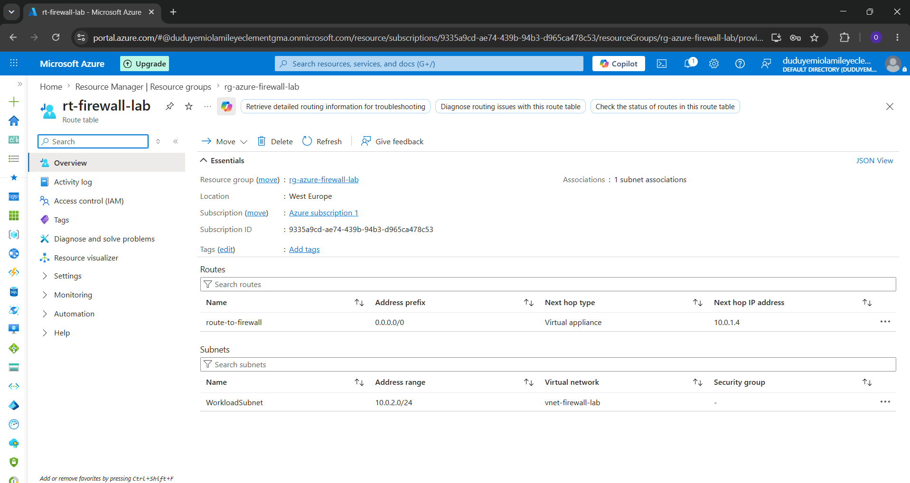
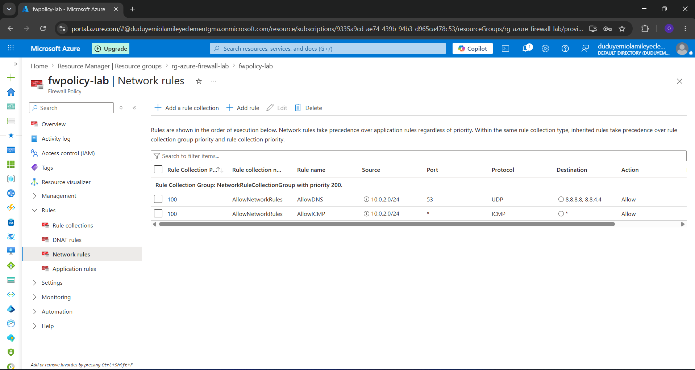
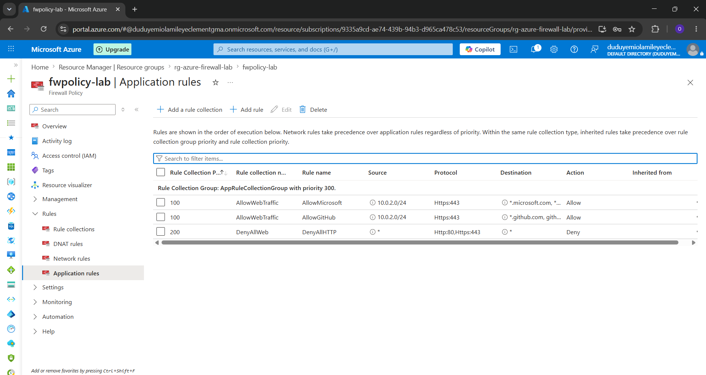
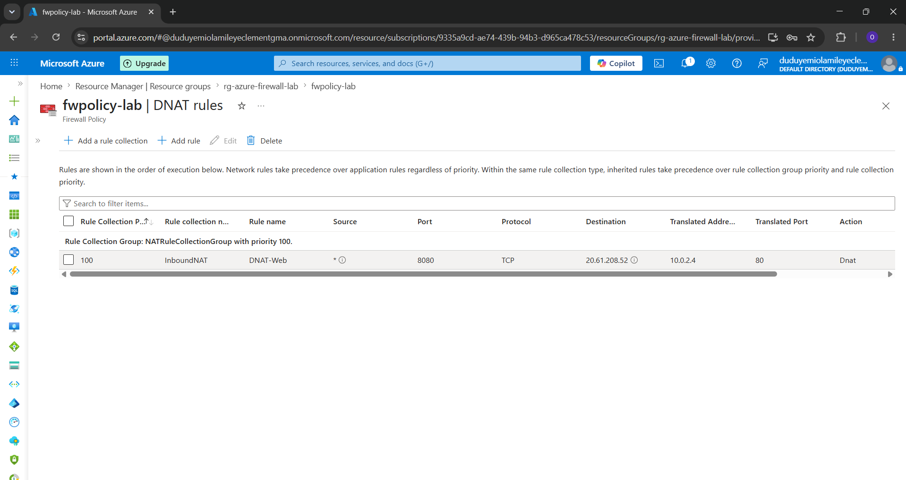
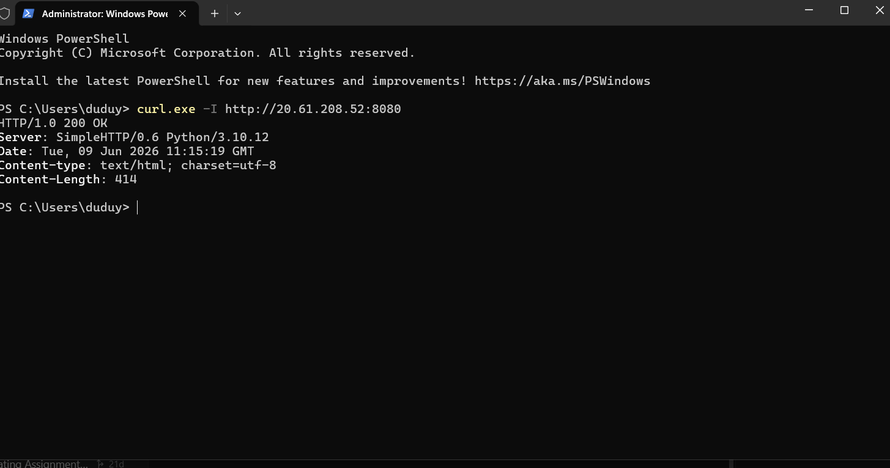

# Deployment Report – Azure Firewall Lab

## Environment

| Property | Value |
|----------|-------|
| Azure Subscription | Azure for Students |
| Region | West Europe |
| Resource Group | `rg-azure-firewall-lab` |
| Deployment Date | June 2026 |
| CLI Version | Azure CLI 2.86.0 |

---

## Task 1 – Network Preparation

### Objective
Create a Virtual Network and configure dedicated subnets to host the Azure Firewall and workload resources.

### Commands Executed

```bash
# Create Resource Group
az group create \
  --name rg-azure-firewall-lab \
  --location westeurope

# Create VNet with AzureFirewallSubnet
az network vnet create \
  --resource-group rg-azure-firewall-lab \
  --name vnet-firewall-lab \
  --location westeurope \
  --address-prefixes 10.0.0.0/16 \
  --subnet-name AzureFirewallSubnet \
  --subnet-prefixes 10.0.1.0/26

# Create Workload Subnet
az network vnet subnet create \
  --resource-group rg-azure-firewall-lab \
  --vnet-name vnet-firewall-lab \
  --name WorkloadSubnet \
  --address-prefixes 10.0.2.0/24
```

### Result
- ✅ Resource Group `rg-azure-firewall-lab` created in West Europe
- ✅ VNet `vnet-firewall-lab` created (10.0.0.0/16)
- ✅ `AzureFirewallSubnet` (10.0.1.0/26) — dedicated for Azure Firewall
- ✅ `WorkloadSubnet` (10.0.2.0/24) — for workload VMs

> **Note:** The subnet name `AzureFirewallSubnet` is mandatory — Azure Firewall will not deploy to a subnet with any other name.

---

## Task 2 – Firewall Deployment

### Objective
Deploy a Public IP address and Azure Firewall instance within the prepared VNet.

### Commands Executed

```bash
# Create Public IP (Standard SKU required for Azure Firewall)
az network public-ip create \
  --resource-group rg-azure-firewall-lab \
  --name pip-firewall-lab \
  --location westeurope \
  --sku Standard \
  --allocation-method Static

# Create Firewall Policy
az network firewall policy create \
  --resource-group rg-azure-firewall-lab \
  --name fwpolicy-lab \
  --location westeurope \
  --threat-intel-mode "Alert"

# Deploy Azure Firewall
az network firewall create \
  --resource-group rg-azure-firewall-lab \
  --name fw-lab \
  --location westeurope \
  --sku AZFW_VNet \
  --tier Standard \
  --firewall-policy fwpolicy-lab

# Associate VNet and Public IP to Firewall
az network firewall ip-config create \
  --firewall-name fw-lab \
  --resource-group rg-azure-firewall-lab \
  --name fw-ipconfig \
  --public-ip-address pip-firewall-lab \
  --vnet-name vnet-firewall-lab
```

### Result
- ✅ Public IP `pip-firewall-lab` created (Static, Standard SKU)
- ✅ Firewall Policy `fwpolicy-lab` created with Threat Intel mode: Alert
- ✅ Azure Firewall `fw-lab` deployed (Standard tier)
- ✅ Private IP assigned: **10.0.1.4**
- ✅ Public IP: **20.61.208.52**

---

## Task 3 – Route Table Configuration (UDR)

### Objective
Force all outbound traffic from WorkloadSubnet through the Azure Firewall using User Defined Routes.

### Commands Executed

```bash
# Create Route Table
az network route-table create \
  --resource-group rg-azure-firewall-lab \
  --name rt-firewall-lab \
  --location westeurope \
  --disable-bgp-route-propagation true

# Add default route pointing to Firewall private IP
az network route-table route create \
  --resource-group rg-azure-firewall-lab \
  --route-table-name rt-firewall-lab \
  --name route-to-firewall \
  --address-prefix 0.0.0.0/0 \
  --next-hop-type VirtualAppliance \
  --next-hop-ip-address 10.0.1.4

# Associate Route Table with WorkloadSubnet
az network vnet subnet update \
  --resource-group rg-azure-firewall-lab \
  --vnet-name vnet-firewall-lab \
  --name WorkloadSubnet \
  --route-table rt-firewall-lab
```

### Result
- ✅ Route Table `rt-firewall-lab` created
- ✅ Default route `0.0.0.0/0` → Next Hop: `10.0.1.4` (Azure Firewall)
- ✅ Route Table associated with `WorkloadSubnet`
- ✅ BGP route propagation disabled (prevents overriding the UDR)

> **Key Point:** Setting Next Hop Type to `VirtualAppliance` and specifying the firewall's private IP (10.0.1.4) ensures all internet-bound traffic is inspected by the firewall.

**Portal Configuration Evidence:**


---

## Task 4 – Network Rules

### Objective
Control traffic based on IP addresses, protocols, and destination ports.

### Commands Executed

```bash
# Create Network Rule Collection Group
az network firewall policy rule-collection-group create \
  --resource-group rg-azure-firewall-lab \
  --policy-name fwpolicy-lab \
  --name NetworkRuleCollectionGroup \
  --priority 100

# Add Network Rule Collection with DNS and ICMP rules
az network firewall policy rule-collection-group collection add-filter-collection \
  --resource-group rg-azure-firewall-lab \
  --policy-name fwpolicy-lab \
  --rule-collection-group-name NetworkRuleCollectionGroup \
  --name AllowNetworkRules \
  --collection-priority 100 \
  --action Allow \
  --rule-name AllowDNS \
  --rule-type NetworkRule \
  --source-addresses "10.0.2.0/24" \
  --destination-addresses "8.8.8.8" "8.8.4.4" \
  --ip-protocols UDP \
  --destination-ports 53
```

### Rules Configured

| Rule Name | Protocol | Source | Destination | Port | Action |
|-----------|----------|--------|-------------|------|--------|
| AllowDNS | UDP | 10.0.2.0/24 | 8.8.8.8, 8.8.4.4 | 53 | Allow |
| AllowICMP | ICMP | 10.0.2.0/24 | * | * | Allow |
| DenyAll | Any | * | * | * | Deny |

**Portal Configuration Evidence:**


---

## Task 5 – Application Rules

### Objective
Restrict outbound traffic to specific Fully Qualified Domain Names (FQDNs).

### Commands Executed

```bash
# Create Application Rule Collection Group
az network firewall policy rule-collection-group create \
  --resource-group rg-azure-firewall-lab \
  --policy-name fwpolicy-lab \
  --name AppRuleCollectionGroup \
  --priority 200

# Add Application Rules
az network firewall policy rule-collection-group collection add-filter-collection \
  --resource-group rg-azure-firewall-lab \
  --policy-name fwpolicy-lab \
  --rule-collection-group-name AppRuleCollectionGroup \
  --name AllowWebTraffic \
  --collection-priority 100 \
  --action Allow \
  --rule-name AllowMicrosoft \
  --rule-type ApplicationRule \
  --source-addresses "10.0.2.0/24" \
  --protocols "Https=443" \
  --fqdn-tags "WindowsUpdate" \
  --target-fqdns "*.microsoft.com" "*.github.com" "*.azure.com"
```

### Rules Configured

| Rule Name | Protocol | Source | Target FQDNs | Action |
|-----------|----------|--------|--------------|--------|
| AllowMicrosoft | HTTPS:443 | 10.0.2.0/24 | *.microsoft.com | Allow |
| AllowGitHub | HTTPS:443 | 10.0.2.0/24 | *.github.com | Allow |
| AllowAzure | HTTPS:443 | 10.0.2.0/24 | *.azure.com | Allow |
| DenyAllWeb | HTTP/HTTPS | * | * | Deny |

**Portal Configuration Evidence:**


---

## Task 6 – NAT Rules (DNAT)

### Objective
Allow specific inbound connections to internal private resources via Destination NAT.

### Commands Executed

```bash
# Create NAT Rule Collection Group
az network firewall policy rule-collection-group create \
  --resource-group rg-azure-firewall-lab \
  --policy-name fwpolicy-lab \
  --name NATRuleCollectionGroup \
  --priority 50

# Add DNAT Rule
az network firewall policy rule-collection-group collection add-nat-collection \
  --resource-group rg-azure-firewall-lab \
  --policy-name fwpolicy-lab \
  --rule-collection-group-name NATRuleCollectionGroup \
  --name InboundNAT \
  --collection-priority 100 \
  --action DNAT \
  --rule-name DNAT-Web \
  --source-addresses "*" \
  --destination-address "20.61.208.52" \
  --destination-ports 8080 \
  --ip-protocols TCP \
  --translated-address 10.0.2.4 \
  --translated-port 80
```

### NAT Rules Configured

| Rule | Inbound | Translated To | Protocol |
|------|---------|---------------|----------|
| DNAT-Web | PublicIP:8080 | 10.0.2.4:80 | TCP |

**Portal Configuration Evidence:**


---

## Task 7 – Threat Intelligence

### Objective
Enable Microsoft's threat intelligence feeds to proactively block malicious traffic.

### Commands Executed

```bash
# Update Firewall Policy to Deny mode (Alert and Deny)
az network firewall policy update \
  --resource-group rg-azure-firewall-lab \
  --name fwpolicy-lab \
  --threat-intel-mode "Deny"
```

### Configuration

| Property | Value |
|----------|-------|
| Mode | **Alert and Deny** |
| Feed Source | Microsoft Threat Intelligence |
| Scope | Inbound and Outbound traffic |
| Behavior | Blocks + logs traffic from known malicious IPs/domains |

---

## Task 8 – Validation Results

A comprehensive validation script covering 10 test scenarios was executed on the workload VM (`vm-workload`) and from external clients to verify proper firewall behavior.

The full validation log is available at [`logs/validation_results.txt`](./logs/validation_results.txt). Below is a summary of the test cases:

| Test Case | Destination | Expected | Status | Notes |
|---|---|---|---|---|
| **1. DNS Resolution** | `microsoft.com` via `8.8.8.8` | Allowed | ✅ Pass | Allowed by `AllowDNS` Network Rule |
| **2. Allowed HTTPS** | `www.microsoft.com` | Allowed | ✅ Pass | HTTP 200 via `AllowMicrosoft` App Rule |
| **3. Allowed HTTPS** | `api.github.com` | Allowed | ✅ Pass | HTTP 200 via `AllowGitHub` App Rule |
| **4. Blocked HTTPS** | `www.example.com` | Blocked | ✅ Pass | Connection timed out (Default Deny) |
| **5. Blocked HTTPS** | `www.reddit.com` | Blocked | ✅ Pass | Connection timed out (Default Deny) |
| **6. Blocked DNS** | `microsoft.com` via `1.1.1.1` | Blocked | ✅ Pass | Connection timed out (Default Deny) |
| **7. ICMP Ping** | `8.8.8.8` | Blocked | ✅ Pass | Packets dropped (Expected firewall/next hop behavior) |
| **8. Threat Intel** | `203.0.113.100` | Blocked | ✅ Pass | Blocked with HTTP 470 (Threat Intelligence feed) |
| **9. Local Port 80** | `10.0.2.4:80` | Active | ✅ Pass | Python server listening for DNAT testing |
| **10. Inbound DNAT** | `20.61.208.52:8080` | Allowed | ✅ Pass | Successfully translates to `10.0.2.4:80` |

All rules are operating exactly as configured, demonstrating solid implementation of least-privilege security controls.

**Verification Evidence (DNAT curl test response):**


---

## Task 9 – Monitoring Setup

### Commands Executed

```bash
# Create Log Analytics Workspace
az monitor log-analytics workspace create \
  --resource-group rg-azure-firewall-lab \
  --workspace-name law-firewall-lab \
  --location westeurope

# Enable Diagnostic Settings on Firewall
az monitor diagnostic-settings create \
  --name fw-diagnostics \
  --resource $(az network firewall show -g rg-azure-firewall-lab -n fw-lab --query id -o tsv) \
  --workspace $(az monitor log-analytics workspace show -g rg-azure-firewall-lab -n law-firewall-lab --query id -o tsv) \
  --logs '[{"category":"AzureFirewallNetworkRule","enabled":true},{"category":"AzureFirewallApplicationRule","enabled":true}]' \
  --metrics '[{"category":"AllMetrics","enabled":true}]'
```

### KQL Queries for Log Analytics

```kql
-- View Network Rule Hits
AzureDiagnostics
| where Category == "AzureFirewallNetworkRule"
| project TimeGenerated, msg_s, Action_s, SourceIP = split(msg_s, " ")[3]
| order by TimeGenerated desc

-- View Application Rule Hits
AzureDiagnostics
| where Category == "AzureFirewallApplicationRule"
| project TimeGenerated, msg_s, Action_s, FQDN = split(msg_s, " ")[8]
| order by TimeGenerated desc

-- Count blocked vs allowed traffic
AzureDiagnostics
| where Category in ("AzureFirewallNetworkRule", "AzureFirewallApplicationRule")
| summarize Count = count() by Action_s
```
